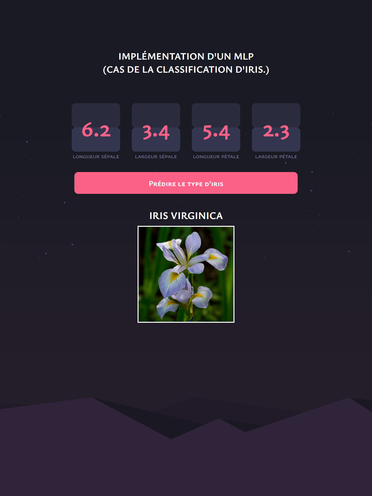

# Multilayer Perceptron - Iris Classifier from Scratch

Un projet fullstack simple et pédagogique où j'ai implémenté un **Perceptron Multicouche (MLP)** en **Python + NumPy**, sans utiliser de framework de machine learning.

Le modèle est capable de **prédire les 3 classes de la base Iris** (Setosa, Versicolor, Virginica) à partir des dimensions des pétales et sépales.

## MLP Démo



Interface simple en HTML/CSS/JavaScript + Flask qui :
- Récupère les dimensions de la fleur saisies par l'utilisateur
- Les envoie au backend Flask
- Affiche la prédiction (Iris Setosa, Versicolor ou Virginica)

## Dataset utilisé

Le **jeu de données Iris** (inclus dans `sklearn.datasets.load_iris`) contient :
- 150 exemples
- 4 caractéristiques :
  - Longueur du sépale (cm)
  - Largeur du sépale (cm)
  - Longueur du pétale (cm)
  - Largeur du pétale (cm)
- 3 classes :
  - `Iris Setosa`
  - `Iris Versicolor`
  - `Iris Virginica`

## Modèle MLP

- Implémenté **from scratch** avec NumPy (pas de scikit-learn, keras, pytorch…)
- Architecture configurable (par défaut : 4-10-3)
- Activation : ReLU (couches cachées), Softmax (sortie)
- Fonction de perte : Cross Entropy
- Optimisation : Gradient Descent

## Structure du projet

```bash
📁 mlp/
├── 📂 api/
│   ├── model
│   ├── module.py        
│   └── server.py        
├── 📂 app/            
│   ├── design         
│   ├── images       
│   ├── app.js         
│   ├── index.html    
│   └── style.css
├── iris.csv
├── mlp.png
├── Perceptron_Multicouche.ipynb
├── xor_mlp.ipynb
└── README.md
```

## Lancer le projet localement

### 1. Cloner le repo

```bash
git clone https://github.com/nullhq/mlp.git
cd mlp
```

### 2. Lancer le serveur Flask

```bash
cd api
python server.py
```
### 3. Lancer l'interface web

```bash
cd app
open index.html
```
## Résultats

Le modèle atteint une précision > 95% sur les données de test (80/20 split).

## Technologies utilisées

- **Python + NumPy** – Implémentation du MLP
- **Flask** – Backend API pour exposer le modèle
- **HTML / CSS / JS** – Interface simple pour entrer les données

## Objectifs pédagogiques

- Comprendre le fonctionnement interne d’un MLP
- Implémenter toutes les étapes d’un modèle de deep learning (forward, backward, update)
- Déployer une interface simple pour l’utilisation